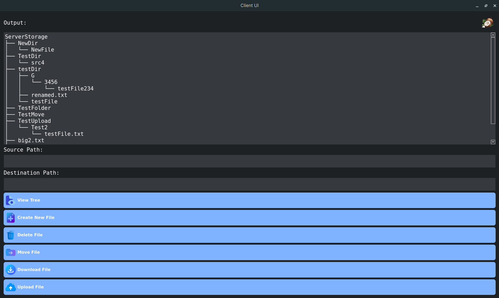

# User Interface Client (PyQt5)

The client application is designed to interact with a remote file server. It utilizes a **Sliding Window Protocol** based on **Selective repeat with NAK** for reliable data transfer and provides a user-friendly interface for managing remote files.

## Architecture

The application is structured into three distinct layers:

1.  **User Interface Layer (`ClientWindow`)**: 
    *   Based on **PyQt5**.
    *   Handles user input (source/destination paths) and output feedback.
    *   Provides controls for file operations and configuration updates.

2.  **Concurrency Layer (`ClientWorker`)**:
    *   Inherits from **QThread**.
    *   Runs operations on a separate thread to prevent the GUI from freezing during data transfer.
    *   Communicates results or errors back to the UI via signals (`result_ready`, `error_occurred`).

3.  **Logic Layer (`Client`)**:
    *   Manages the state of the connection and operation sequencing.
    *   Utilizes a `DataTransferManager` to handle the low-level details of the custom Sliding Window Protocol (packets, timeouts, retransmissions).

## Application Flow

The standard workflow for any operation follows this sequence:

1.  **User Interaction**: The user enters file paths (Source/Destination) and clicks an operation button (for example "Upload File").
2.  **Thread Start**: The UI disables input and spawns a `ClientWorker` thread.
3.  **Request Preparation**: The `Client` class prepares the specific Operation Header (e.g., `H_OP_UPLOAD`) and payload (file paths or content).
4.  **Transmission**: The `DataTransferManager` sends the packets to the server.
5.  **Response Handling**: The client enters a listening state (`endOp_get_data`), waiting for the server to confirm success or return requested data (like a directory tree).
6.  **UI Update**: Upon completion, the worker thread emits the data back to the main window, which updates the "Output" log and re-enables the controls.

## Features

*   **View Tree**: Retrieve and display the remote directory structure.
*   **Create File**: Initialize new files on the server.
*   **Delete File**: Remove files from the remote server.
*   **Move File**: Relocate files within the server's file system.
*   **Upload/Download**: Transfer files reliably between the local machine and the server.
*   **Dynamic Configuration**: Update network parameters (Window Size, Packet Size, Timeouts).

## Requirements

*   Python 3.x
*   PyQt5

### Supported Operations
[SUPPORTED_OPERATIONS](../OPERATIONS/OPERATIONS.md)

### Client Operation Flow

The client handles operations in a two-phase synchronous process: **Initiation (`startOp`)** and **Finalization (`endOp`)**.

#### 1. Operation Initiation (`startOp`)
When a specific operation method is called (for example `startOp_download_file`):

1.  **State Check**: The client first checks `self.in_operation`. If an operation is already in progress, the request is ignored.
2.  **Queue Clearing**: It clears the receiving queue and sending lists to ensure no leftover data from previous transactions interferes.
3.  **Header Transmission**:
    *   It prepares a packet containing only the **Operation Header** (`H_OP_DOWNLOAD`, `H_OP_CREATE`, etc).
    *   It immediately sends this packet to the server.
4.  **Payload Transmission**:
    *   If the operation requires arguments (like a file path or file content), the client prepares a second batch of packets containing this data.
    *   It sends these packets immediately after the header.
    *   For complex ops like Upload, this happens in multiple stages.

#### 2. Response Awaiting (`endOp_get_data`)
Immediately after initiating, the system calls this blocking method to wait for the server's verdict:

1.  **Listening Loop**: The method enters a while True loop, calling `data_manager.listen()` repeatedly.
2.  **Data Accumulation**: As packets arrive, payload data is extracted and appended to a `chunks` list.
3.  **Status Detection**:
    *   The client inspects the **Custom Headers** of every incoming packet.
    *   It specifically looks for **Flow Control Headers**:
        *   `H_OP_SUCCESS`: The server completed the task successfully.
        *   `H_OP_FAILED`: The server encountered an error (e.g., file not found).
4.  **Termination**:
    *   Once a Success or Failure header is detected, the loop breaks.
    *   The `in_operation` flag is reset to `False`.
    *   The accumulated data (text response or file content) is joined and returned to the UI.
